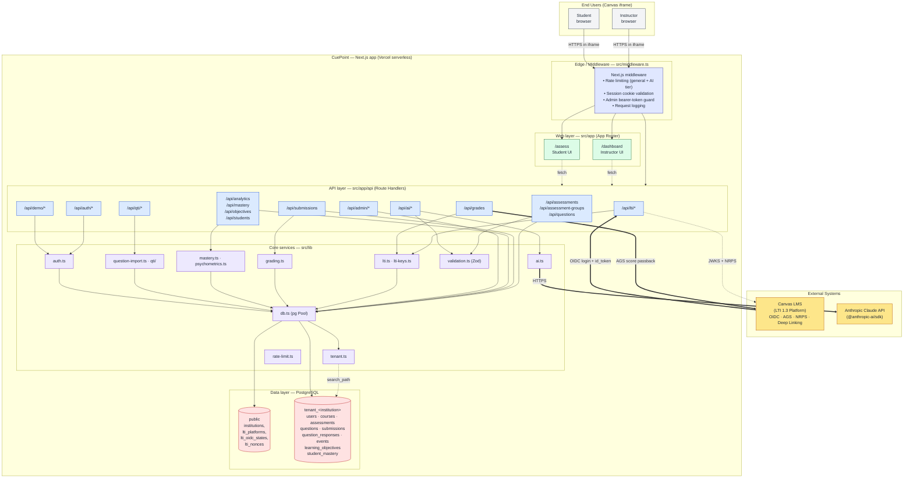
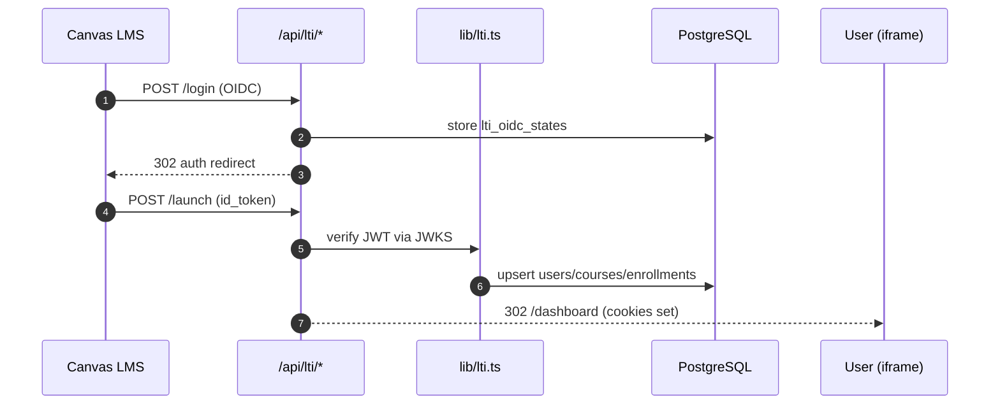
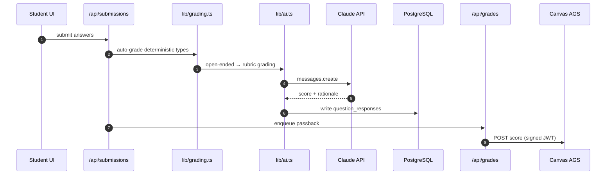

# CuePoint — Backend Architecture

> A walkthrough of the CuePoint backend for engineering and leadership reviews.
> Diagrams are authored in Mermaid and render natively on GitHub.

- **Container view** → [`backend-architecture.mmd`](./backend-architecture.mmd)
- **Runtime flows** → [`request-flows.mmd`](./request-flows.mmd)

---

## 1. One-line summary

CuePoint is a Next.js app deployed serverlessly (Vercel) that embeds inside Canvas via LTI 1.3, stores data in multi-tenant PostgreSQL, and calls Anthropic Claude for authoring, grading, and analytics.

## 2. Container view

## 3. Layer-by-layer tour

### 3.1 Edge / middleware — `src/middleware.ts`
One centralized file enforces the cross-cutting security concerns on every `/api/*` call *before* route handlers run:

| Concern | Implementation |
|---|---|
| Rate limiting | `rate-limiter-flexible` with two tiers — **general** and a stricter **AI** tier for `/api/ai/*` |
| Session | Reads `iat_user_id` / `iat_user_role` cookies set at LTI launch; rejects with 401 if missing |
| Public routes | `/api/lti/*`, `/api/auth/*`, `/api/demo/*` are exempted from session checks |
| Admin routes | `/api/admin/*` requires `Authorization: Bearer $ADMIN_SECRET` |
| Observability | Adds `X-Response-Time` header and logs method/path/status/duration |

### 3.2 Web layer — `src/app` (Next.js App Router)
- `dashboard/` — instructor UI (assessments, question bank, groups, analytics, mastery, settings)
- `assess/` — student assessment runner with 14 question types + STEM content editor (MathLive + CodeMirror)

Both are React Server Components that call the API layer for mutations and client-side data.

### 3.3 API layer — `src/app/api` (Route Handlers)
Thin controllers. Each handler: validates input with Zod → calls a `lib/*` service → returns JSON.

| Prefix | Purpose |
|---|---|
| `/api/lti/*` | LTI 1.3 OIDC login, launch, JWKS, deep linking, roster (NRPS), platform registration, warmup |
| `/api/auth/[...nextauth]` | NextAuth.js Canvas OAuth fallback |
| `/api/demo/*` | No-Canvas demo login (instructor + student) for sales and local dev |
| `/api/assessments`, `/api/assessment-groups`, `/api/questions` | CRUD + publish/archive, bulk import |
| `/api/submissions` | Start attempt, persist answers, finalize and trigger grading |
| `/api/grades` | Canvas AGS score passback |
| `/api/analytics`, `/api/mastery`, `/api/objectives`, `/api/students` | Reporting, learning-objective mastery, course roster |
| `/api/ai/*` | `generate`, `generate-assessment`, `grade`, `insights`, `student-insights`, `ask` (NL Q&A), `speech-to-latex`, `extract-text` |
| `/api/qti/*` | QTI 2.1 import / export |
| `/api/admin/*` | Institution and platform management, nonce cleanup |

### 3.4 Core services — `src/lib`

| File | Responsibility |
|---|---|
| `db.ts` | `pg` connection pool tuned for serverless; `query`, `transaction`, `tenantQuery`, `tenantTransaction` (scoped via `SET search_path`) |
| `lti.ts` | LTI 1.3 OIDC flow, Advantage services (AGS, NRPS, Deep Linking), platform lookups |
| `lti-keys.ts` | Tool private-key management, JWT sign/verify via `jose`, JWKS endpoint |
| `auth.ts` | Session helpers, `requireRole()` fine-grained guards inside handlers |
| `grading.ts` | Deterministic auto-grader for MC/MS/TF/numeric/matching/ordering/FIB; partial credit & tolerance |
| `ai.ts` | Claude SDK wrapper; prompt templates for generation, grading, insights, Q&A |
| `mastery.ts` / `psychometrics.ts` | Bloom's + learning-objective mastery, item analysis |
| `tenant.ts` | Per-institution schema resolution from cookies / context |
| `rate-limit.ts` | Tiered rate limits invoked from middleware |
| `validation.ts` | Zod schemas for every request body |
| `question-import.ts` / `qti/` | CSV / Excel (`xlsx`) and QTI parsing |

### 3.5 Data layer — PostgreSQL

**Multi-tenancy model (migration `005_multi_tenancy.sql`):** the `public` schema holds the cross-tenant registry (`institutions`, `lti_platforms`, `lti_oidc_states`, `lti_nonces`, `lti_registrations`). Each institution gets its own schema (e.g. `tenant_<slug>`) containing the full application tables. `db.ts` sets `search_path` per checkout so unqualified queries resolve to the correct tenant.

**Main tables per tenant** (migrations 001–007):

- **Identity & context** — `users`, `courses`, `course_enrollments`, `lti_launch_contexts`, `lti_access_tokens`
- **Authoring** — `question_banks`, `questions`, `assessments`, `assessment_groups`, `assessment_group_items`
- **Student data** — `submissions`, `question_responses`, `response_events`, `usage_events`
- **Mastery** — `learning_objectives`, `question_objectives`, `student_mastery`

**Pool sizing** — `max: 5` on serverless (because each function instance gets its own pool) with an external PgBouncer / Neon / Supabase pooler in production; `max: 20` locally. Idle timeout is 10s on serverless so connections are released before the function freezes.

## 4. Cross-cutting concerns

| Concern | Approach |
|---|---|
| **AuthN** | LTI 1.3 OIDC (primary), Canvas OAuth (fallback), Demo login (dev/sales) |
| **AuthZ** | Middleware enforces "is authenticated"; `requireRole()` in handlers enforces instructor/student/TA/admin |
| **Input validation** | Zod schemas in `lib/validation.ts` per endpoint |
| **Rate limiting** | `rate-limiter-flexible`; stricter tier for AI endpoints to cap Claude spend |
| **Secrets** | `.env` / Vercel env vars — `ANTHROPIC_API_KEY`, `DATABASE_URL`, `ADMIN_SECRET`, LTI private key |
| **Security headers** | HSTS, CSP, X-Frame-Options tuned for Canvas iframe embedding (`next.config.ts`) |
| **Observability** | Middleware logs; `X-Response-Time` header; dev-mode query logging in `db.ts` |
| **Resilience** | DB retries on transient connection errors; LTI nonce-window-aware fast-fail on connect |

## 5. Runtime flows

See [`request-flows.mmd`](./request-flows.mmd). The four flows covered:

1. **LTI 1.3 launch** — Canvas → `/api/lti/login` → redirect → `/api/lti/launch` → JWT verified via Canvas JWKS → user/course/enrollment upserted → session cookies set → `/dashboard` or `/assess` rendered in the iframe.
2. **Student submission & passback** — `/api/submissions` → `lib/grading.ts` auto-grades → writes `submissions` + `question_responses` + `response_events` → `/api/grades` → `lib/lti.ts` AGS client → Canvas line-item score.
3. **AI question generation** — `/api/ai/generate` → `lib/ai.ts` → Claude → Zod-validated JSON → persisted as draft questions for instructor review.
4. **AI grading** — Open-ended / essay / file-upload responses flagged by the auto-grader are sent to `lib/ai.ts` for rubric-based scoring; score + rationale written back to `question_responses`.

## 6. Deployment topology

- **Compute** — Vercel serverless functions (Next.js 16, Node 22). Warmup endpoint (`/api/lti/warmup`) kept hot to avoid cold-start inside the LTI nonce window.
- **Database** — Managed PostgreSQL behind a connection pooler (PgBouncer / Neon / Supabase).
- **Secrets** — Vercel env vars; tool private key stored as PEM env var, JWKS served from `/api/lti/jwks`.
- **External** — Canvas LMS (per institution), Anthropic Claude API.

## 7. How to read the files

- Open `backend-architecture.mmd` in any Mermaid-aware editor (VS Code Mermaid preview, mermaid.live, GitHub).
- This `backend-architecture.md` renders inline on GitHub / Notion / most wikis and is the best single document to share in a review.
- Run `npx @mermaid-js/mermaid-cli -i backend-architecture.mmd -o backend-architecture.svg` to export a static SVG for slide decks.
