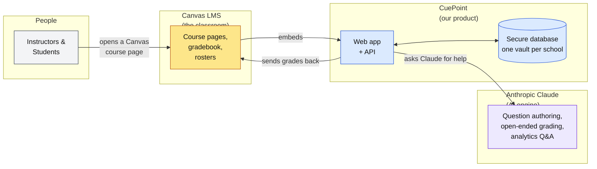
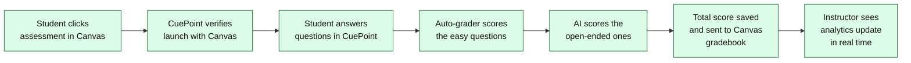

# CuePoint — Backend Overview for Leadership

> A plain-language tour of how CuePoint works behind the scenes. No code, no jargon.

---

## What CuePoint is, in one sentence

CuePoint lets instructors embed rich, AI-powered assessments directly inside their Canvas course pages — authored fast, graded automatically, and scored back to the Canvas gradebook without students ever leaving the LMS.

## Why the backend matters

Three things make or break this product, and all three live in the backend:

1. **It must feel native to Canvas.** The handshake with Canvas has to be invisible and instant, or instructors won't adopt it.
2. **It must be trustworthy with student data and grades.** Schools demand tenant isolation, auditability, and predictable grading.
3. **It must make AI cheap and safe.** AI is the differentiator, but it's also the biggest cost and risk, so the backend has to rate-limit, validate, and log every AI call.

The architecture below is designed around those three priorities.

---

## The big picture (one diagram, five boxes)

**Read it like this:**

- A student or instructor lands on a Canvas course page. Canvas hands control off to CuePoint inside an embedded window — the student never leaves Canvas.
- CuePoint's web app talks to its own secure database (one isolated vault per school).
- When CuePoint needs intelligence — drafting questions, grading an essay, answering an analytics question — it calls Anthropic's Claude.
- When a student finishes, CuePoint pushes the score back to Canvas's gradebook automatically.

That's the whole system. Everything else is detail behind those five boxes.

---

## The five things the backend does

### 1. Connects to Canvas safely (LTI 1.3)

Canvas uses a standard called **LTI 1.3** to embed third-party tools. CuePoint implements the full handshake: a signed login, a verified launch, a roster sync, grade passback, and deep linking (so instructors can pick an assessment from inside Canvas without leaving).

**Why leadership cares:** this is what lets us sell to any Canvas institution without custom integration work, and it's what makes the product "feel native." It's also a compliance and security boundary — a broken LTI handshake means no launch, no data, no sale.

### 2. Stores each school's data in its own vault (multi-tenancy)

Every institution that installs CuePoint gets its own private section of our database. A professor at University A literally cannot see or query data from University B — the isolation is enforced at the database level, not just in application code.

**Why leadership cares:** this is what we tell procurement and security reviewers. It's also what lets us grow to hundreds of schools without cross-contamination risk, and it's the foundation for enterprise contracts, FERPA/GDPR conversations, and eventual SOC 2.

### 3. Runs assessments and grades them

When a student answers a question, CuePoint grades the ones it can grade instantly (multiple choice, numeric, matching, fill-in-the-blank, etc.) and then sends the harder ones — essays, open-ended, file uploads — to AI for rubric-based grading. Every answer and every keystroke-level event is logged so instructors get real analytics, not just totals.

**Why leadership cares:** automatic grading is our time-saving promise. The event-level logging is what powers the analytics dashboard and the at-risk-student feature, which are the "sticky" parts of the product.

### 4. Uses AI for authoring, grading, and insights

CuePoint calls Claude for four things:

| Use case | What it does for the user |
|---|---|
| **Question generation** | Draft a full quiz from a topic or uploaded document in seconds |
| **Open-ended grading** | Score essays and short answers against the instructor's rubric |
| **Analytics Q&A** | Instructors ask natural-language questions about their class ("who's struggling with kinematics?") and get a written answer |
| **Speech-to-LaTeX** | Instructors dictate math formulas instead of typing them |

Every AI call goes through a **stricter rate limit** than the rest of the app, so one runaway client can't blow up our monthly Claude bill.

**Why leadership cares:** AI is our biggest differentiator *and* our biggest variable cost. The backend treats it as a controlled resource — metered, logged, and rate-limited — so we can forecast spend and avoid surprises.

### 5. Sends grades back to the Canvas gradebook

After a student submits, CuePoint posts the score back to Canvas automatically, so instructors never have to export/import CSVs. Multiple assessments can even be bundled into a single Canvas gradebook column with configurable weights.

**Why leadership cares:** gradebook passback is the feature instructors check first. If it works, we keep the account. Full stop.

---

## What happens when a student takes an assessment

The whole flow is designed so the student never notices they left Canvas and the instructor never has to manually grade or manually transfer scores.

---

## What we built to keep it safe and scalable

| Concern | What we did | Why it matters to leadership |
|---|---|---|
| **Per-school data isolation** | Separate database schema per institution | Required for enterprise / FERPA conversations |
| **AI cost control** | Dedicated rate limit on every AI endpoint | Caps our Claude spend even if a customer misuses the product |
| **Request validation** | Every API call is schema-checked before it touches the database | Blocks bad data and common security attacks (injection, malformed input) |
| **Canvas-grade security headers** | Locked-down iframe, HTTPS everywhere, signed JWTs for LTI | Passes most institutional security reviews out of the box |
| **Serverless deployment** | Runs on Vercel with a pooled managed PostgreSQL | Scales from one school to hundreds without re-architecting |
| **Admin tools behind a separate password** | Admin endpoints require a dedicated bearer token | Internal tools can't be reached even if a user session is stolen |
| **Audit logging** | Every API call logs method, path, status, duration; every student action logs as an event | Gives us the paper trail for support, billing disputes, and compliance |

---

## What this costs to run (conceptually)

There are three meaningful cost drivers:

1. **Vercel compute** — predictable, scales with traffic. Cheap until we have thousands of concurrent students.
2. **PostgreSQL** — predictable, scales with stored data. Cheap unless someone uploads enormous files.
3. **Anthropic Claude** — the variable one. This is why every AI endpoint has its own rate limit and why question generation returns drafts for instructor review instead of auto-publishing.

Our cost controls (rate limits, caching opportunities, AI-call metering) live in the backend, which is why backend work directly affects our unit economics.

---

## The risks we're actively managing

| Risk | Mitigation already in place |
|---|---|
| **Canvas changes LTI spec** | We follow the IMS Global standard, not Canvas-specific APIs; portable to Blackboard, Moodle, D2L with minimal work |
| **Claude API outage** | AI features degrade gracefully — authoring and grading of the 10+ deterministic question types still work |
| **Runaway AI spend** | Stricter rate limit on all `/api/ai/*` endpoints; AI calls logged per user |
| **Data breach** | Tenant isolation at the database layer; secrets in environment variables, never in code; all traffic over HTTPS |
| **Cold-start latency during LTI launch** | A warmup endpoint keeps the launch path hot so the Canvas handshake never times out |

---

## The one-page takeaway

CuePoint's backend is built around **three non-negotiables**: it has to feel native inside Canvas, it has to isolate every school's data, and it has to treat AI as a metered resource. Every architectural decision — LTI 1.3, per-tenant database schemas, middleware-enforced rate limits, serverless deployment — flows from one of those three priorities. That's what lets us promise "drop it in, trust it with your students, scale it to your whole institution" to customers.

---

*For engineers and architects: see [`backend-architecture.md`](./backend-architecture.md) for the detailed container view and [`request-flows.mmd`](./request-flows.mmd) for per-flow sequence diagrams.*
